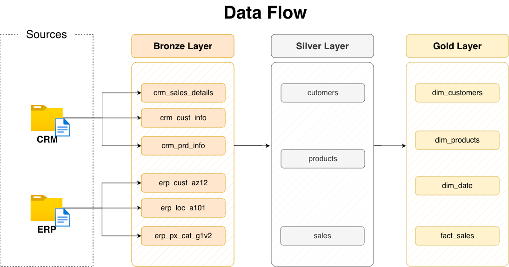

# 🏗️ Data Warehouse Project (Medallion Architecture on SQL Server)


---

## 📌 Overview

This project implements a **modern Data Warehouse** using the **Medallion Architecture (Bronze, Silver, Gold)** on PostgreSQL.

It simulates a real-world data ecosystem where information is ingested from multiple systems **(CRM and ERP)** in CSV format, then transformed, standardized, and modeled into an **analytics-ready star schema**.

The entire solution is designed to run in a **Dockerized PostgreSQL environment**, ensuring portability and reproducibility.

### 🎯 Objective

Demonstrate **end-to-end data engineering capabilities**, including:

* Data ingestion from heterogeneous sources.
* Complex data cleaning (Regex, String manipulation).
* Data modeling (Star Schema).
* Data quality validation and referential integrity.

---

## 🧠 Architecture Overview


```text
Raw Data (CSV) -> Bronze (Raw) -> Silver (Cleaned) -> Gold (Analytical)
```

---

## 📂 Project Structure

```text
/datasets
   /source_crm
   /source_erp

/scripts
   /bronze
      ddl_bronze.sql
      proc_load_bronze.sql -- Ingestion using COPY

   /silver
      ddl_silver.sql
      proc_load_silver.sql -- Business Logic & Cleaning

   /gold
      ddl_gold.sql
      proc_load_gold.sql -- Dimensional Modeling (Star Schema)

/docs
   data_architecture.png
   data_flow.png
   data_model.png
   data_integracion.png
   ETL.png
   data_catalog.md
   naming_conventions.md

init_database.sql
README.md
```

---

## 🥉 Bronze Layer – Raw Ingestion


### Purpose

* Store raw data exactly as received from CRM and ERP systems.
* Preserve source fidelity for future reprocessing.
* Enable traceability and auditability.

### Key Features

* PostgreSQL COPY command for high-performance bulk ingestion.
* Data stored as VARCHAR to prevent ingestion failures due to formatting.
* Batch Metadata: Tracking via _batch_id and _extraction_date.
* Schema-based isolation (bronze schema).

---

## 🥈 Silver Layer – Data Cleaning & Integration


### Purpose

* Clean, standardize, and integrate data from multiple sources into a unified format.

### Key Transformations

* Advanced String Manipulation: Used SUBSTRING and LIKE patterns to trim category prefixes from Product Keys, ensuring compatibility with Sales records.
* Robust Date Handling: Implemented Regex validation (~ '^\d{8}$') before casting to DATE to handle inconsistent source formats.
* Deduplication: Used ROW_NUMBER() window functions to identify and keep only the latest record per entity (e.g., Customers).
* Data Standardization: Normalized categorical fields (Gender, Country) using CASE statements and COALESCE for fallback logic.

### Output Tables

* `silver.customers` (Merged CRM + ERP attributes).
* `silver.products` (Cleaned keys and categorized data).
* `silver.sales` (Standardized transactional records).

---

## 🥇 Gold Layer – Star Schema (Analytics Ready)


### Purpose

Provide a **business-friendly analytical model** optimized for BI tools and complex reporting.

### Model Type

* **Star Schema:** Optimized for query performance and ease of use.

### Dimensions

* `gold.dim_customers` Unified customer profile.
* `gold.dim_products` Product catalog with standardized hierarchy.
* `godl.dim_date` Dynamic calendar generated via generate_series based on the sales date range.

### Fact Table

* `gold.fact_sales` Centralized sales metrics linked via Surrogate Keys.

### Key Features

* **Surrogate Keys (SK):** Built using GENERATED AS IDENTITY to decouple the warehouse from source system volatility.
* **Referential Integrity:** 100% match rate achieved between Facts and Dimensions through deep cleaning in the Silver layer.
* **Batch-ID Tracing:** Every row maintains a reference to its processing batch for easy auditing.

---

## 🔄 Data Flow



This flow illustrates how data is refined through the layers, moving from an unstructured state to high-value business intelligence:

* **Ingestion (Bronze):** High-performance bulk loading of raw CSV files using the PostgreSQL COPY command.
* **Transformation (Silver):** Data cleansing using Regex-based date normalization, Substring logic for key alignment, and window functions for deduplication.
* **Analytical Modeling (Gold):** Creation of a robust Star Schema by mapping business keys to Surrogate Keys (SK), ensuring historical persistence and query performance.

---

## 🧪 Data Quality Framework

Instead of a complex external framework, data integrity is verified directly within the warehouse using Audit Queries to ensure the reliability of the analytical model.

### Validation Coverage

* **Null Value Validation:** Ensures critical fields (e.g., order_number, product_id) contain no missing values.
* **Uniqueness Checks:** Verifies that dimensions maintain record uniqueness, preventing data inflation in joins.
* **Referential Integrity:** Validates that every product_sk and customer_sk in the Fact table exists in its respective Dimension.
* **Relationship Success Rate:** A final diagnostic check is performed to ensure a 100% match rate between Sales and Products, confirming the success of the cleansing logic.

### Validation Coverage

```sql
SELECT 
    COUNT(*) AS total_sales,
    COUNT(product_sk) AS sales_with_product,
    COUNT(customer_sk) AS sales_with_customer,
    ROUND((COUNT(product_sk)::NUMERIC / COUNT(*)) * 100, 2) || '%' AS success_margin
FROM gold.fact_sales;
```

### Results

* ✅ **Success Margin: 100.00%**
* ✅ **Referential Integrity: Fully Verified**

---

## 📚 Documentation

Additional documentation is available in the `/docs` folder:

| Document                | Description                               |
| ----------------------- | ----------------------------------------- |
| `data_catalog.md`       | Detailed description of tables and fields |
| `naming_conventions.md` | Naming standards used across the project  |
| `data_architecture.png` | High-level architecture diagram           |
| `data_model.png`        | Star schema visualization                 |
| `ETL.png`               | ETL process overview                      |
| `data_flow.png`         | Data movement across layers               |

---

## ⚙️ Technologies Used

* PostgreSQL 16+ (Core Database)
* PL/pgSQL (Stored Procedures for ETL logic)
* COPY Command (Efficient CSV data ingestion)
* Docker (Containerized database environment)
* Regex / Window Functions (Advanced data cleaning and deduplication)

---

## ⚠️ Important Note About File Paths

The ingestion process uses PostgreSQL COPY, which requires the database engine to have direct access to the files. If you are using Docker, ensure your dataset is mounted correctly in your docker-compose.yml or docker run command:

```bash
-v /your/local/path/datasets:/data
```

Example of the ingestion logic used:

```sql
COPY bronze.crm_cust_info
FROM '/data/source_crm/cust_info.csv'
DELIMITER ',' CSV HEADER;
```

---

## 🚀 How to Run the Project

### 1. Set Up the Environment (Docker)

Ensure you have Docker and Docker Compose installed. This project includes a docker-compose.yml file to spin up the PostgreSQL instance with the correct configurations.

```bash
# Clone the repository
git clone https://github.com/your-username/your-repo-name.git
cd your-repo-name

# Start the PostgreSQL container
docker-compose up -d
```

### 2. Initialize Database & Schemas

Connect to your PostgreSQL instance (using psql, DBeaver, or pgAdmin) and run the initialization script to create the database and the Bronze, Silver, and Gold schemas.

```bash
# Example using psql from your terminal
psql -h localhost -p 5432 -U <user> -d postgres -f scripts/init_database.sql
```

### 3. Load Bronze Layer (Raw Ingestion)

This step triggers the COPY commands to ingest the CSV files into the raw tables.

```sql
\i scripts/bronze/proc_load_bronze.sql
CALL bronze.load_bronze();
```

### 4. Load Silver Layer (Clean & Integrate)

This step executes the cleaning logic, regex validations, and system integrations.

```sql
\i scripts/silver/proc_load_silver.sql
CALL silver.load_silver();
```

### 5. Load Gold Layer (Analytical Model)

Final step to populate the Star Schema and generate the dynamic date dimension.

```sql
\i scripts/gold/proc_load_gold.sql
CALL gold.load_gold();
```

---

## 💡 Key Engineering Decisions

* Medallion Architecture → Implementation of a 3-layer (Bronze, Silver, Gold) structure to ensure a clear separation between raw data, cleaned integration, and business modeling.
* Regex-Based Validation over Simple Casting → Used PostgreSQL POSIX operators (~ '^\d+$') within CASE statements to validate data formats before casting, preventing entire pipeline failures due to malformed source strings.
* String Normalization Strategy → Developed custom SUBSTRING and REPLACE logic in the Silver layer to resolve systemic key mismatches between CRM and ERP datasets.
* Physical Tables in Gold → Chose persisted tables over views for the Star Schema to ensure data consistency, allow for indexing, and optimize performance for BI tool consumption.
* Surrogate Keys (SK) → Utilized GENERATED AS IDENTITY to create internal warehouse keys, decoupling the model from source system volatility and optimizing analytical joins.
* SCD Type 1 Implementation → Selected Type 1 Dimensions for the current scope to maintain simplicity and focus on high-performance reporting.

---

## 📈 Future Enhancements

* SCD Type 2 Implementation → Add historical tracking for key attributes (e.g., customer address or product price changes) using start_date and end_date logic.
* Workflow Orchestration → Integrate with Apache Airflow or Dagster to automate the execution of stored procedures and monitor pipeline health.
* Automated Data Quality Suite → Build a dedicated testing schema to automate null checks, uniqueness, and referential integrity audits.
* Advanced Indexing & Partitioning → Implement table partitioning in the Gold layer to handle larger datasets and improve query response times.
* BI Dashboard Integration → Connect the Gold layer to Power BI or Tableau to visualize the growth metrics and KPIs identified.

---

## 🧠 Lessons Learned

* **Data Quality is the Bottleneck:** Inconsistent data (like mismatched product codes) is inevitable. Handling these issues early in the Silver layer is the difference between a broken report and a 100% match rate.
* **Normalization is Key:** Integrating different systems (CRM vs. ERP) requires a deep understanding of business keys and a standardized normalization strategy.
* **The Power of Schemas:** Using PostgreSQL schemas (bronze, silver, gold) significantly improves project organization, security, and maintenance.
* **Iterative Validation:** Running diagnostic queries throughout the development process is essential; "Testing is not an after-thought, it's a core part of the engineering process."
* **Simplicity Scales:** A clean, procedural-based ETL design is easier to debug, document, and hand over to other engineering teams.

---

## 🎯 What This Project Demonstrates

* **End-to-End Data Pipeline:** Full implementation from raw CSV ingestion to a business-ready analytical layer.
* **Advanced SQL & PL/pgSQL:** Expert use of Stored Procedures, Regex validations, and complex window functions for data refining.
* **Dimensional Modeling Expertise:** Design and implementation of a Star Schema with Surrogate Keys (SK) and referential integrity.
* **Data Integration Mastery:** Successful merging of heterogeneous data sources (CRM & ERP) through sophisticated key normalization.
* **Production-Level Organization:** Clean project structure using PostgreSQL Schemas for clear environment separation.

---

## 👤 Author

**Jan Hernandez**  

---

## ⭐ Final Thoughts

This project reflects real-world data engineering practices, focusing on the three pillars of a modern data stack:

* **Scalability:** Designed to handle increasing data volumes through efficient PostgreSQL COPY and schema-based layering.
* **Reliability:** Built-in data cleaning and validation logic that achieved a 100.00% match rate in the final model.
* **Maintainability:** Fully documented code and procedural-based ETL for easy auditing and updates.

It is designed to be technically solid, easy to reproduce, and ready for evaluation in professional technical interviews.

---

🚀 *If you found this project useful or interesting, feel free to star the repository.*
